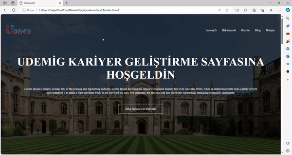

<h1> travel-project </h1>

Bu seyahat projesi, modern web teknolojileri olan HTML5 ve CSS3 

kullanılarak tasarlanmış bir kullanıcı arayüzü sunmaktadır. Projede, 

kullanıcıları etkileşime davet eden, şık ve kullanımı kolay bir tasarım anlayışı benimsenmiştir.

HTML5'in sunduğu zengin yapısal elementler ve CSS3'ün güçlü stil 

seçenekleri, seyahat deneyimini daha etkileyici hale getirmek için kullanılmıştır. 

Proje, farklı ekran boyutlarına uyum sağlayacak şekilde tasarlanmıştır. 

<h1>ekran görüntüsü</h1>

